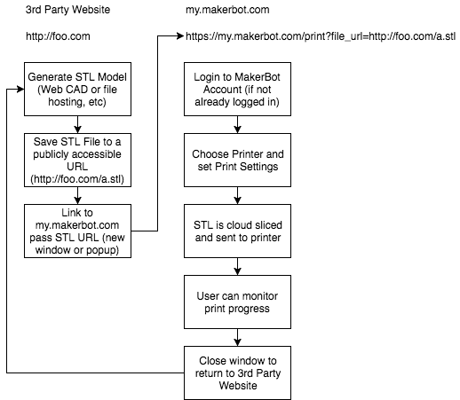
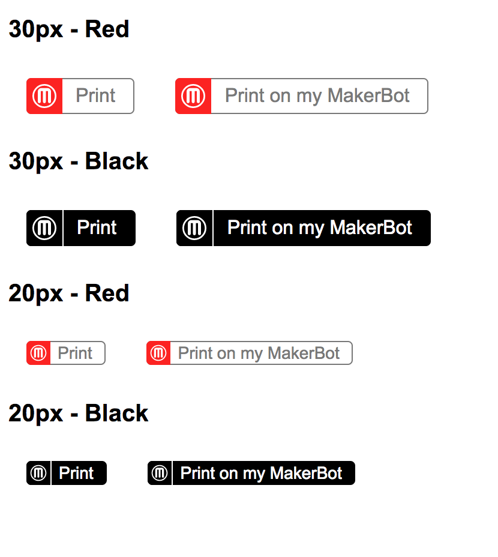

# Web Print

The [My MakerBot](https://www.makerbot.com/media-center/2017/06/25/education-cloud-my-makerbot-educators-guidebook) website allows passing an .stl file url in
order to print on your MakerBot printer.  This simple integration allows
you to send a user to My MakerBot where the file
can be cloud sliced and sent to their printer all within a web browser and
doesn't require installing any software.

All you need to do is have the user click a link like this:

https://my.makerbot.com/print?file_url=https://cdn.thingiverse.com/assets/53/37/54/22/f1/20mm-box.stl

## Button Styles
Here are the button styles that should be used when using MakerBot’s Web Print Integration:
A few notes:
- Two button styles for you to choose from to use on your site, app or service.
- The larger button is preferred for clarity, but where it does not fit we have provided a smaller button.
- If a button can not be placed in the UI or there are multiple fulfillment providers, please use our full logo located [here](buttons/makerbot-logo.svg).

View the [HTML](buttons/index.html) & [CSS](buttons/button.css).

### Full Logo

